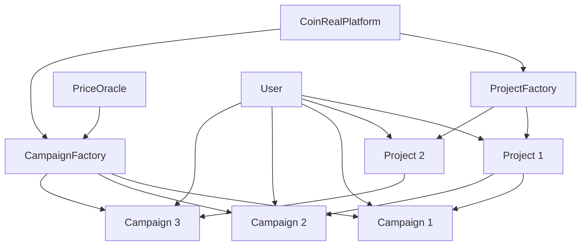

# CoinReal 


> The first decentralized content community that realizes "comments equal income, likes equal coins" through an innovative Campaign reward mechanism

## 🎯 Project Overview

CoinReal is an innovative Web3 content community platform that allows users to participate in crypto project discussions and receive real token rewards through smart contracts and campaign reward systems. The project adopts a project-campaign separation architecture to achieve a flexible reward mechanism and a sustainable community incentive model.

### Core Features
- **🎁 Campaign Reward Mechanism**: Anyone can create a campaign and customize reward tokens and amounts
- **💰 Instant Rewards**: 5 CRT for comments and 1 CRT for likes (in all active campaigns)
- **🔒 Soulbound Token**: CRT tokens are non-transferable and represent real contribution
- **⚖️ Fair distribution**: 60% comment reward + 25% like reward + 15% elite reward
- **🔄Multiple Campaigns in Parallel**: Users can receive rewards in multiple campaigns at the same time

- **⏰ Smart extension**: Automatically extend the period by 7 days when there are no participants to avoid wasting resources

## 🏗️ Project Architecture

### Technology Stack
#### Backend (smart contracts)
```
Solidity ^0.8.19
├── Contract framework: OpenZeppelin
├── Development Tools: Foundry
├── Test Network: Anvil (local) / Sepolia (test)
└── Deployment tool: Forge Script

```
#### Front-end (Web Application)
```
Next.js 15.2.4 + React 19.0.0
├── Web3 integration: Wagmi 2.15.6 + Viem 2.x
├── State Management: TanStack Query 5.81.2
├── UI framework: Tailwind CSS 4.0 + shadcn/ui
├── Type support: TypeScript 5
└── Package management: pnpm

```

### Campaign system architecture


## 🎮 Campaign workflow
### 1. Project creation
```
User → CoinRealPlatform.createProject() → ProjectFactory → Project contract deployment

```
### 2. Campaign creation
```
Sponsor → Token authorization → CampaignFactory.createCampaign() → Campaign contract deployment → Add to Project

```
### 3. User Engagement
```
User comments/likes → Project contract → Notify all active campaigns → Mint CRT rewards

```
### 4. Reward Distribution
```
Campaign ends → Platform distributes rewards → Users receive real tokens

```

## 📁 Project Structure
```
CoinReal/
├── background/ # Smart contract backend
│ ├── src/ # Contract source code
│ │ ├── CoinRealPlatform.sol # Platform main contract
│ │ ├── Project.sol # Project contract
│ │ ├── Campaign.sol # Campaign contract (ERC20)
│ │ ├── ProjectFactory.sol # Project Factory
│ │ ├── CampaignFactory.sol
│ │ └── MockPriceOracle.sol # Price Oracle
│ ├── script/ # Deployment script
│ ├── test/ # Contract test
│ ├── abi-json/ # ABI file
│ └── deployments.json # Deployment information
├── frontend/ # Web front-end application
│ ├── app/ # Next.js page
│ ├── components/ # React components
│ ├── hooks/ # Custom Hooks
│ ├── lib/ # Tool library
│ ├── types/ # Type definition
│ └── public/ # Static resources
└── README.md # Project documentation

```

## 🚀 Quick Start
### Environmental Requirements
- Node.js 18+
- pnpm 8+
- Foundry (for contracts)

- Git
### 1. Clone the project
```bash
git clone<repository-url>
cd CoinReal

```
### 2. Install dependencies
```bash
# Install front-end dependencies
cd frontend

pnpm install
# Install contract dependencies
cd ../background
forge install

```
### 3. Start the local blockchain
```bash
cd background
anvil

```
### 4. Deploy the contract
```bash
# Deploy the contract in a new terminal
forge script script/Deploy.s.sol \
--private-key 0xac0974bec39a17e36ba4a6b4d238ff944bacb478cbed5efcae784d7bf4f2ff80 \
--rpc-url http://localhost:8545 \

--broadcast
# Copy ABI and deployment information to the front end
cp abi-json/*.json ../frontend/public/abi-json/
cp deployments.json ../frontend/public/deployments.json

```
### 5. Start the front end
```bash
cd ../frontend
pnpm-dev

```

Visit http://localhost:3000 to get started!

## 💰 Detailed explanation of reward mechanism
### CRT Token System
- **Naming convention**: `Project name-Campaign number` (eg: Bitcoin-Campaign1)
- **Token symbol**: CRT (fixed)
- **Precision**: 18 decimal places, displayed as integers at the front end

- **Feature**: Soulbound (non-transferable), represents real contribution
### Reward Rules
| Behavior | CRT Rewards | Description |
|------|---------|------|
| Post a comment | 5 CRT | Earn in all active campaigns |
| Like Comment | 1 CRT | Likers get |

| Liked | 1 CRT | Liked person gets |
### Allocation mechanism
At the end of the campaign, the prize pool will be distributed in the following proportions:
- **60%** - distributed to all participants based on their CRT percentage
- **25%** - distributed to active users who like according to the percentage of CRT of likes

- **15%** - equally divided among the reviewers who received the most CRTs (elite reward)
### Automatic extension

If there are no participants at the end of the campaign, it will be automatically extended for 7 days to avoid wasting reward resources.

## 🔧 Smart Contract Interface

### Core Contract
#### CoinRealPlatform (Platform Main Contract)
```Solidity
// Create a project
function createProject(
string calldata name,
string calldata symbol,
string calldata description,
string calldata category,
uint16 drawPeriod

) external returns (address projectAddress);
// Get the project list
function getProjects(uint256 offset, uint256 limit)

external view returns (ProjectInfo[] memory, uint256 total);
// Get platform statistics
function getPlatformStats() external view returns (
uint256 totalProjects,
uint256 totalUsers,
uint256 totalComments,
uint256 totalCampaigns
);

```
#### Project (Project Contract)
```Solidity
// Post a comment
function postComment(string calldata content)

external returns (uint256 commentId);
// Like the comment

function likeComment(uint256 commentId) external;
// Get user CRT details
function getUserCampaignCRTDetails(address user) external view returns (
address[] memory campaignAddresses,
uint256[] memory commentCRTs,
uint256[] memory likeCRTs,
uint256[] memory totalCRTs,
uint256[] memory pendingRewards
);

```
#### Campaign (Campaign contract, inherited from ERC20)
```Solidity
// ERC20 basic functions (Soulbound)
function balanceOf(address account) external view returns (uint256);

function totalSupply() external view returns (uint256);
// Get user CRT details
function getUserCRTBreakdown(address user) external view returns (
uint256 commentTokens,
uint256 likeTokens,
uint256 totalTokens,
uint256 pendingReward

);
// Receive rewards
function claimRewards() external;

```
#### CampaignFactory
```Solidity
// Create a Campaign
function createCampaign(
address project,
string calldata sponsorName,
uint256 duration,
address rewardToken,
uint256 rewardAmount
) external returns (address campaignAddress);

```

## 🌐 Front-end API interface
### Project related
```TypeScript
// Get the project list

const projects = await api.getProjects(offset?, limit?)
// Get project details

const project = await api.getProject(projectAddress)
// Create a project
const projectAddress = await api.createProject(projectData)

```
### Campaign related
```TypeScript
// Get the project Campaign list

const campaigns = await api.getProjectCampaigns(projectAddress)
// Create a Campaign
const campaignAddress = await api.createCampaign({
projectAddress,
sponsorName,
duration,
rewardToken,
rewardAmount

})
// Get user CRT details

const userCRT = await api.getUserCampaignCRTDetails(projectAddress, userAddress)
// Receive rewards
await api.claimCampaignReward(campaignAddress)

```
### Comments
```TypeScript
// Get the comment list

const comments = await api.getProjectComments(projectAddress)
// Post a comment (get 5 CRTs)

const comment = await api.postComment(projectAddress, content)
// Like the comment (both parties get 1 CRT)
await api.likeComment(projectAddress, commentId)

```

## 📊 Data conversion
### CRT precision conversion
```TypeScript
// 18 decimal places → integer display

const displayCRT = parseInt(formatUnits(crtAmount, 18))
// integer → 18 decimal places
const weiCRT = parseUnits(amount.toString(), 18)

```
### Time processing
```TypeScript
// Calculate the remaining time

const remainingTime = Math.max(0, endTime - Math.floor(Date.now() / 1000))
// Friendly display
const formatTime = (seconds) => {
const days = Math.floor(seconds / 86400)
const hours = Math.floor((seconds % 86400) / 3600)
return days > 0 ? `${days} days ${hours} hours` : `${hours} hours`
}

```

## 🛡️ Security Features
### Contract Security
- **Permission Control**: Role-based access control
- **Reentrancy protection**: Use OpenZeppelin's ReentrancyGuard
- **Integer overflow**: Solidity 0.8+ built-in protection

- **Minimum proxy mode**: save 95% of deployment costs and reduce attack surface
### Front-end security
- **Input Validation**: All user input is strictly validated
- **XSS Protection**: Safe content rendering

- **Network Verification**: Ensures connection to the correct blockchain network

## 🔍 Technical Highlights
### 1. Project-Campaign separation architecture
- **Separation of responsibilities**: Projects focus on content management, Campaigns focus on reward distribution
- **Flexible expansion**: Anyone can create a campaign for a project

- **Independent governance**: Each Campaign has independent reward rules
### 2. Soulbound CRT Token
- **Real Contribution**: Tokens are non-transferable and represent real participation
- **Anti-brushing mechanism**: Prevent robots from brushing rewards

- **Fair competition**: fair distribution based on contribution
### 3. Minimal Proxy Mode
- **Cost optimization**: Save 95%+ of deployment gas fees
- **Standardization**: All campaigns use the same implementation logic

- **Security**: Reduce contract complexity and attack surface
### 4. Automatic extension mechanism
- **Resource optimization**: Avoid wasting rewards on invalid campaigns
- **User-friendly**: Give more time for participation

- **Platform Management**: Automated Campaign Lifecycle Management

## 📈 Usage scenarios
### 1. Project promotion
- Create a campaign to promote a new project
- Attract user attention through token rewards

- Get real user feedback and discussions
### 2. Community Building
- Reward active community members
- Promote the creation of high-quality content

- Establish a sustainable incentive mechanism
### 3. Investor Research
- Get rewards for participating in project discussions
- Demonstrate professionalism through CRT balance

- Get first-hand project information
### 4. KOL influence
- Earn elite rewards through high-quality reviews
- Build professional reputation and influence

- Get extra token benefits

## 🚀 Future plans
### Short-term goals (3 months)
- [ ] Deploy to Sepolia test network
- [ ] Improve the elite review algorithm
- [ ] Add more tokens support

- [ ] Mobile terminal adaptation
### Medium-term goals (6 months)
- [ ] Mainnet deployment
- [ ] Layer 2 integration (Polygon/Arbitrum)
- [ ] NFT Reward System

- [ ] Enhanced social functions
### Long-term goals (1 year)
- [ ] Multi-chain expansion
- [ ] DAO governance system
- [ ] AI content recommendation

- [ ] Enterprise-level features

## 🤝 Contribution Guidelines
Development Process
1. Fork the project to your personal repository
2. Create a feature branch: `git checkout -b feature/amazing-feature`
3. Commit the changes: `git commit -m 'Add amazing feature'`
4. Push the branch: `git push origin feature/amazing-feature`

5. Create a Pull Request
### Coding Standards
- **Solidity**: Follows the OpenZeppelin style guide
- **TypeScript**: Use strict mode, complete type definition
- **Test**: Maintain 90%+ code coverage

### Problem Feedback
- Report bugs using GitHub Issues
- Describe in detail the steps to reproduce the problem
- Provide relevant logs and screenshots

## 📄 License

This project is licensed under the MIT License - see the [LICENSE](LICENSE) file for details.

## 📞 Contact Us

- **GitHub**: [Project repository](https://github.com/your-org/coinreal)
- **Discord**: [Community Channel](https://discord.gg/coinreal)
- **Twitter**: [@CoinReal](https://twitter.com/coinreal)
- **Email**: contact@coinreal.io

---

## 📊 Project Statistics


---

*CoinReal - Make every opinion valuable and every participation profitable* 🚀
