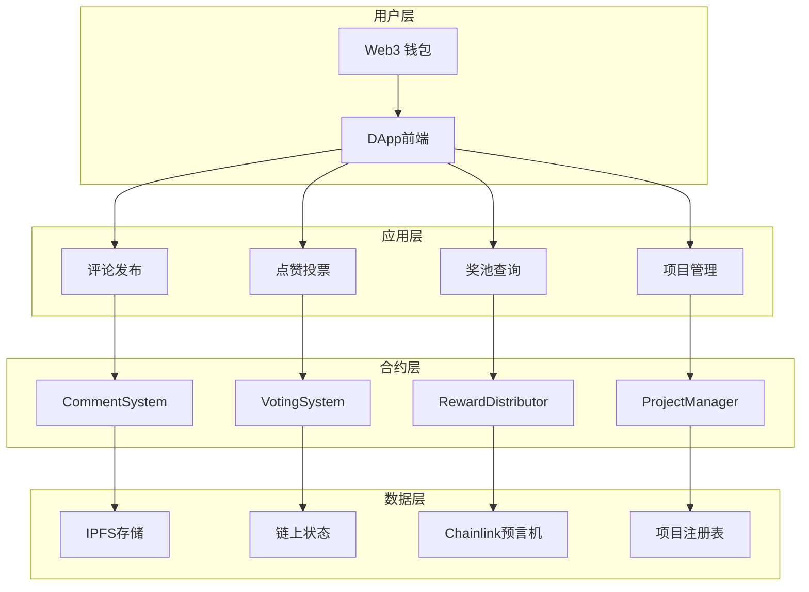

# CoinReal - 币圈大众点评

> 首个让用户通过评论与点赞即可赚取加密货币奖励的去中心化内容社区

## 🎯 项目概述

### 产品定位
CoinReal 是一个创新的去中心化内容社区平台，通过区块链技术实现"评论即收益、点赞即赚币"的商业模式。用户可以在各大加密项目的讨论栏目中发表评论、点赞支持优质内容，并获得相应的代币奖励。赞助方可以赞助他喜欢的项目，赞助的金额会根据动态奖池分配给评论和点赞的用户。

### 核心愿景
打造一个完全去中心化的内容价值评估生态系统，让优质内容创作者和价值发现者都能获得公平的经济回报，推动加密货币社区的健康发展。

## 🔥 核心产品需求

### 1. 用户准入机制 (去中心化身份验证)

#### 1.1 评论者准入条件
- **持币验证**: 历史一个月内持有目标项目代币，且历史资产价值 ≥ $100 USD
- **链上验证**: 通过 Chainlink 预言机实时验证用户钱包资产
- **防刷机制**: 每个钱包地址24小时内仅可对同一项目发表一条评论

#### 1.2 点赞者准入条件  
- **最低资产**: 当前钱包资产 ≥ $1 USD
- **活跃度要求**: 账户需有至少3笔链上交易记录
- **频率限制**: 每个地址每小时最多点赞10次
- **关系验证**: 不可对自己的评论点赞(通过合约地址检查)

### 2. 代币经济模型 (TokenEconomics)

#### 2.1 点评Token机制
```
每个项目创建时自动部署独立的 ERC-20 "点评Token"
- Token名称: [项目名]_Review_Token (例: BTC_Review_Token)
- 初始供应量: 0 (动态铸造)
- 铸造机制: 仅通过用户行为触发
- 销毁机制: 奖池分配后全部销毁,重置游戏
```

#### 2.2 Token获取规则
| 行为 | 获得Token数量 | 触发条件 |
|------|---------------|----------|
| 发表评论 | 20 个基础Token | 通过持币验证 |
| 评论被点赞 | +1 个奖励Token | 每获得一个赞 |
| 点赞他人评论 | 1 个参与Token | 每次有效点赞 |
| 优质评论奖励 | +25% Token | 开奖后进入热度前10 |

#### 2.3 热度计算公式
```
用户热度 = 基础Token + 点赞Token + 时间加权奖励
时间加权系数 = 1 + (周期总时长 - 参与时间) / 周期总时长 * 0.5
```

### 3. 动态奖池分配系统

#### 3.1 奖池资金来源
- **项目方赞助**: 项目方可向自己项目奖池注入资金
- **平台收益**: 交易手续费的10%进入全局奖池
- **社区捐献**: 用户可自愿向喜爱项目捐献
- **合作伙伴**: 交易所、钱包等合作方赞助

#### 3.2 分配机制详解
```
基础奖励池 (60%): 
- 按用户Token占比分配
- 计算公式: 用户奖励 = (用户Token数量 / 总Token数量) * 基础奖池

精英奖励池 (25%):
- 热度排名前10用户均分
- 平均分配,避免马太效应

随机点赞奖励 (15%):
- 从所有点赞用户中随机选择10%
- 最少保证1人获奖
- 使用VRF随机数确保公平性
```

#### 3.3 开奖周期管理
- **灵活周期**: 项目方可设置7-30天开奖周期
- **自动执行**: 到期自动触发分配,无需人工干预（chainlink automation）
- **资金安全**: 奖池资金托管在项目合约中
- **奖励发放**：发放的奖励由赞助的ETH或者对应的Token决定（可能发方eth、USDC、BNB Token），按照分配机制自动发放

### 4. 项目管理系统

#### 4.1 项目创建流程
1. **提交申请**: 填写项目基本信息(名称、简介、官网、白皮书)
2. **代币部署**: 自动创建项目专属的点评Token合约
3. **奖池初始化**: 设置初始奖池和开奖周期
4. **项目上线**: 开放评论和点赞功能

#### 4.2 项目信息标准
```json
{
  "name": "项目名称",
  "symbol": "代币符号", 
  "description": "项目描述",
  "website": "官方网站",
  "whitepaper": "白皮书链接",
  "contractAddress": "项目合约地址",
  "chainId": "所在链ID",
  "category": "项目分类(DeFi/NFT/GameFi/L1/L2等)",
  "launchDate": "创建时间",
  "totalSupply": "代币总供应量",
  "marketCap": "市值(通过预言机获取)"
}
```

### 5. 评论系统详细设计

#### 5.1 评论内容规范
- **字数限制**: 10-500字符
- **格式支持**: 支持Markdown格式和链接
- **多语言**: 支持中英文内容

#### 5.2 评论存储机制
```
链上存储: 评论哈希、时间戳、作者地址、Token奖励记录
IPFS存储: 完整评论内容(通过哈希索引)
本地缓存: 前端展示优化,减少链上查询
```

#### 5.3 评论排序算法
```
热度排序 = (点评Token数) * 时间衰减系数
时间衰减 = 1 / (1 + (当前时间 - 发布时间) / 86400) * 0.3
最终排序 = 热度排序 * (1 + 随机因子 * 0.1)
```

### 6. 基础安全机制

#### 6.1 智能合约安全
- **权限控制**: 合约owner权限管理
- **基础验证**: 输入参数有效性检查
- **资金安全**: 奖池资金安全存储

## 🔧 技术架构升级

### 智能合约架构
```
ProjectFactory.sol - 项目工厂合约(创建和管理项目)
├── ProjectManager.sol - 单个项目管理
├── ReviewToken.sol - 项目专属ERC20代币  
├── CommentSystem.sol - 评论系统
├── VotingSystem.sol - 点赞投票系统
├── RewardDistributor.sol - 奖励分配器
└── PriceOracle.sol - 价格预言机集成
```

### 数据流架构


### 多链部署策略
```
主链 (Ethereum): 核心治理和高价值项目
侧链 (Polygon): 日常交互和小额交易
Layer2 (Arbitrum): 高频操作和批量处理
BSC: 面向币安生态用户
```

## 📱 用户体验设计

### 核心用户流程

#### 新用户引导流程
1. **连接钱包** → 检测资产情况
2. **选择项目** → 展示可参与项目列表
3. **了解规则** → 交互式教程说明
4. **首次评论** → 获得奖励体验成就感
5. **社区互动** → 点赞他人内容获得Token

#### 日常使用流程
```
登录检查资产 → 浏览项目列表 → 选择感兴趣项目 → 
阅读其他评论 → 发表个人观点 → 点赞优质内容 → 
查看收益统计 → 等待奖池开奖 → 领取奖励
```

### 界面设计要求
- **简洁直观**: 降低Web3产品使用门槛
- **数据可视化**: 清晰展示奖池、排名、收益数据
- **移动优先**: 响应式设计支持手机使用  
- **多语言**: 支持中英文切换
- **无障碍**: 支持屏幕阅读器等辅助功能

## 🚀 产品路线图

### Phase 1: MVP核心功能 (3个月)
- [ ] 基础评论和点赞功能
- [ ] 简单奖池分配机制
- [ ] 基础项目管理
- [ ] Web端DApp开发
- [ ] 测试网部署和内测

### Phase 2: 增强功能 (2个月)  
- [ ] 完整治理系统
- [ ] 高级反作弊机制
- [ ] 移动端适配优化
- [ ] 多链支持扩展
- [ ] 主网正式上线

### Phase 3: 生态建设 (持续)
- [ ] 合作伙伴接入API
- [ ] 数据分析面板
- [ ] 社区激励计划
- [ ] 第三方开发者SDK
- [ ] 国际化市场推广

## 🎯 商业模式

### 收入来源
1. **交易手续费**: 奖励分配时收取2%手续费
2. **项目方服务费**: 项目上线收取一次性费用
3. **高级功能**: 数据分析、营销工具等增值服务
4. **合作分成**: 与交易所、钱包的合作收益

### 成本结构
- **开发维护**: 技术团队薪资和服务器费用
- **运营推广**: 社区建设和市场营销

## 📊 关键指标 (KPIs)

### 用户增长指标
- 日活跃用户数 (DAU)
- 新用户注册转化率
- 用户留存率 (7日、30日)
- 平均用户生命周期价值

### 平台活跃度
- 日均评论发布数量
- 日均点赞交互次数  
- 项目讨论参与度
- 用户平均停留时长

### 经济指标
- 平台总锁仓价值 (TVL)
- 奖池资金周转率
- 用户平均收益率
- 项目方续费率

## 🏗️ 技术架构

### 系统架构图

```mermaid
graph TB
    subgraph "前端层 (Web DApp)"
        A[Next.js 15 + TypeScript]
        B[shadcn/ui 组件库]
        C[Tailwind CSS]
        D[钱包连接 (WalletConnect)]
    end
    
    subgraph "区块链层 (Smart Contracts)"
        E[项目管理合约]
        F[评论系统合约]
        G[点赞系统合约]
        H[奖池管理合约]
        I[Token管理合约]
        J[预言机合约]
    end
    
    subgraph "外部服务"
        K[Chainlink Oracle]
        L[IPFS 存储]
        M[多链网络支持]
    end
    
    A --> D
    D --> E
    E --> F
    F --> G
    G --> H
    H --> I
    I --> J
    J --> K
    F --> L
    E --> M
```

### 技术栈

#### 前端 (Web DApp)
- **框架**: Next.js 15 (App Router)
- **语言**: TypeScript
- **样式**: Tailwind CSS + shadcn/ui
- **状态管理**: React 19 内置状态
- **钱包集成**: WalletConnect, MetaMask
- **Web3**: ethers.js / wagmi

#### 后端 (Smart Contracts)
- **开发框架**: Foundry (Forge, Cast, Anvil)
- **编程语言**: Solidity ^0.8.19
- **安全库**: OpenZeppelin
- **预言机**: Chainlink Price Feeds
- **多链支持**: Ethereum, Polygon, BSC, Arbitrum
- **存储**: IPFS (去中心化存储)

#### 基础设施
- **测试网络**: Anvil (本地), Goerli, Mumbai
- **部署工具**: Forge Scripts
- **监控**: Tenderly, Etherscan
- **安全**: 多重签名钱包 (Gnosis Safe)

## 📁 项目结构

```
CoinReal/
├── web/                    # 前端 DApp
│   ├── app/               # Next.js App Router 页面
│   │   ├── page.tsx       # 首页 Landing Page
│   │   ├── projects/      # 项目相关页面
│   │   ├── user/          # 用户个人中心
│   │   └── leaderboard/   # 排行榜页面
│   ├── components/        # React 组件
│   │   ├── ui/           # 基础 UI 组件
│   │   ├── comment-section.tsx
│   │   ├── wallet-connection.tsx
│   │   └── project-layout.tsx
│   └── lib/              # 工具函数和配置
│
├── background/            # 后端智能合约
│   ├── src/              # Solidity 合约源码
│   │   ├── ProjectManager.sol
│   │   ├── CommentSystem.sol
│   │   ├── LikeSystem.sol
│   │   ├── RewardPool.sol
│   │   ├── TokenManager.sol
│   │   ├── PriceOracle.sol
│   │   └── AccessControl.sol
│   ├── test/             # 合约测试
│   ├── script/           # 部署脚本
│   └── lib/              # 外部依赖
│
└── docs/                 # 项目文档
    ├── API.md            # API 接口文档
    ├── DEPLOYMENT.md     # 部署指南
    └── SECURITY.md       # 安全说明
```

## 🚀 快速开始

### 环境要求
- Node.js 23+
- Foundry
- Git

# CoinReal 智能合约接口文档

## 1. 合约架构概述

CoinReal采用模块化设计，主要包含以下合约：

### 1.1 核心合约
- **CoinRealPlatform**: 平台主合约，管理项目创建和全局设置
- **ProjectFactory**: 项目工厂合约，使用最小代理模式创建项目
- **Project**: 项目实现合约，管理单个项目的评论、点赞和奖池
- **PriceOracle**: 价格预言机接口，获取代币USD价值

### 1.2 设计原则
- 使用Clone模式（EIP-1167）节省Gas
- 无后端依赖，所有数据存储在链上
- 支持多币种奖池
- 自增ID实现时间顺序

## 2. 接口详细设计

### 2.1 IPriceOracle - 价格预言机接口

```solidity
interface IPriceOracle {
    /**
     * @notice 获取代币的USD价值
     * @param token 代币地址
     * @param amount 代币数量
     * @return usdValue 对应的USD价值（精度：8位小数）
     */
    function getUSDValue(address token, uint256 amount) external view returns (uint256 usdValue);
    
    /**
     * @notice 批量获取多个代币的USD价值
     * @param tokens 代币地址数组
     * @param amounts 代币数量数组
     * @return totalUSDValue 总USD价值
     */
    function getBatchUSDValue(
        address[] calldata tokens, 
        uint256[] calldata amounts
    ) external view returns (uint256 totalUSDValue);
}
```

### 2.2 IProject - 项目合约接口

```solidity
interface IProject {
    // 事件定义
    event ProjectInitialized(string name, string symbol, address creator);
    event CommentPosted(uint256 indexed commentId, address indexed user, string content);
    event CommentLiked(uint256 indexed commentId, address indexed liker);
    event SponsorshipAdded(address indexed sponsor, address token, uint256 amount);
    event RewardsDistributed(uint256 timestamp, uint256 totalComments, uint256 totalLikes);
    
    // 结构体定义
    struct Comment {
        uint256 id;          // 自增ID，实现时间顺序
        address author;      // 评论者地址
        string content;      // 评论内容（10-500字符）
        uint256 likes;       // 点赞数
        uint256 crtReward;   // 获得的CRT奖励
        bool isElite;        // 是否为精英评论
    }
    
    struct Sponsorship {
        address token;       // 代币地址
        uint256 amount;      // 数量
        address sponsor;     // 赞助者地址
    }
    
    struct UserStats {
        uint256 totalComments;   // 总评论数
        uint256 totalLikes;      // 总点赞数
        uint256 totalCRT;        // 总CRT数量
        uint256 claimedRewards;  // 已领取奖励
    }
    
    /**
     * @notice 初始化项目（仅能调用一次）
     * @param _name 项目名称
     * @param _symbol 项目符号
     * @param _description 项目描述
     * @param _category 项目分类
     * @param _drawPeriod 开奖周期（天）
     * @param _creator 创建者地址
     * @dev 由工厂合约在克隆后调用
     */
    function initialize(
        string calldata _name,
        string calldata _symbol,
        string calldata _description,
        string calldata _category,
        uint16 _drawPeriod,
        address _creator
    ) external;
    
    /**
     * @notice 发表评论
     * @param content 评论内容（10-500字符）
     * @return commentId 评论ID
     * @dev 每条评论自动获得5个CRT
     */
    function postComment(string calldata content) external returns (uint256 commentId);
    
    /**
     * @notice 点赞评论
     * @param commentId 评论ID
     * @dev 每个用户只能对同一评论点赞一次
     * @dev 点赞者获得1个CRT，被点赞评论获得额外CRT
     */
    function likeComment(uint256 commentId) external;
    
    /**
     * @notice 赞助项目奖池
     * @param token 代币地址
     * @param amount 数量
     * @dev 最低赞助金额为100 USD等值代币
     */
    function sponsor(address token, uint256 amount) external;
    
    /**
     * @notice 触发开奖并分配奖励
     * @dev 需要至少有1条评论才能开奖
     * @dev 按照60%评论奖励、25%点赞奖励、15%精英奖励分配
     */
    function distributeRewards() external;
    
    /**
     * @notice 用户领取奖励
     * @param tokens 要领取的代币地址数组
     * @dev 根据用户CRT占比分配各种代币
     */
    function claimRewards(address[] calldata tokens) external;
    
    /**
     * @notice 获取评论详情
     * @param commentId 评论ID
     * @return comment 评论信息
     */
    function getComment(uint256 commentId) external view returns (Comment memory);
    
    /**
     * @notice 获取所有评论（分页）
     * @param offset 起始位置
     * @param limit 数量限制
     * @return comments 评论数组
     * @return total 总评论数
     */
    function getComments(uint256 offset, uint256 limit) external view returns (
        Comment[] memory comments,
        uint256 total
    );
    
    /**
     * @notice 获取精英评论（点赞数前10）
     * @return eliteComments 精英评论数组
     */
    function getEliteComments() external view returns (Comment[] memory eliteComments);
    
    /**
     * @notice 获取用户统计信息
     * @param user 用户地址
     * @return stats 用户统计
     */
    function getUserStats(address user) external view returns (UserStats memory stats);
    
    /**
     * @notice 获取奖池信息
     * @return sponsorships 所有赞助记录
     * @return totalUSDValue 奖池总USD价值
     */
    function getPoolInfo() external view returns (
        Sponsorship[] memory sponsorships,
        uint256 totalUSDValue
    );
    
    /**
     * @notice 获取用户可领取的奖励
     * @param user 用户地址
     * @return tokens 代币地址数组
     * @return amounts 可领取数量数组
     */
    function getPendingRewards(address user) external view returns (
        address[] memory tokens,
        uint256[] memory amounts
    );
    
    /**
     * @notice 检查用户是否已点赞某评论
     * @param user 用户地址
     * @param commentId 评论ID
     * @return hasLiked 是否已点赞
     */
    function hasUserLikedComment(address user, uint256 commentId) external view returns (bool);
    
    /**
     * @notice 获取项目统计数据
     * @return totalParticipants 总参与人数
     * @return totalLikes 总点赞数
     * @return lastActivityTime 最后活动时间
     * @return currentPoolUSD 当前奖池USD价值
     */
    function getProjectStats() external view returns (
        uint256 totalParticipants,
        uint256 totalLikes,
        uint256 lastActivityTime,
        uint256 currentPoolUSD
    );
    
    /**
     * @notice 获取用户在项目中的活动历史
     * @param user 用户地址
     * @param offset 起始位置
     * @param limit 数量限制
     * @return commentIds 用户评论ID数组
     * @return likedCommentIds 用户点赞的评论ID数组
     */
    function getUserActivity(address user, uint256 offset, uint256 limit) external view returns (
        uint256[] memory commentIds,
        uint256[] memory likedCommentIds
    );
}
```

### 2.3 IProjectFactory - 项目工厂接口

```solidity
interface IProjectFactory {
    event ProjectCreated(address indexed project, string name, address indexed creator);
    
    /**
     * @notice 创建新项目
     * @param name 项目名称
     * @param symbol 项目符号
     * @param description 项目描述
     * @param category 项目分类
     * @param drawPeriod 开奖周期（天）
     * @return projectAddress 新项目地址
     * @dev 使用最小代理模式克隆项目实现合约
     */
    function createProject(
        string calldata name,
        string calldata symbol,
        string calldata description,
        string calldata category,
        uint16 drawPeriod
    ) external returns (address projectAddress);
    
    /**
     * @notice 获取项目实现合约地址
     * @return implementation 实现合约地址
     */
    function getImplementation() external view returns (address);
    
    /**
     * @notice 预测项目地址
     * @param salt 创建盐值
     * @return predicted 预测的地址
     */
    function predictProjectAddress(bytes32 salt) external view returns (address);
}
```

### 2.4 ICoinRealPlatform - 平台主合约接口

```solidity
interface ICoinRealPlatform {
    event ProjectFactoryUpdated(address indexed newFactory);
    event PriceOracleUpdated(address indexed newOracle);
    event PlatformFeeUpdated(uint256 newFee);
    
    struct ProjectInfo {
        address projectAddress;
        string name;
        string symbol;
        address creator;
        uint256 createdAt;
        bool isActive;
    }
    
    struct ProjectDetailedData {
        address projectAddress;
        string name;
        string symbol;
        string description;
        uint256 totalParticipants;
        uint256 totalComments;
        uint256 totalLikes;
        uint256 poolValueUSD;
        uint256 nextDrawTime;
        string category;
        bool isActive;
    }
    
    /**
     * @notice 创建新项目（仅平台方可调用）
     * @param name 项目名称
     * @param symbol 项目符号
     * @param description 项目描述
     * @param category 项目分类
     * @param drawPeriod 开奖周期（天）
     * @return projectAddress 新项目地址
     */
    function createProject(
        string calldata name,
        string calldata symbol,
        string calldata description,
        string calldata category,
        uint16 drawPeriod
    ) external returns (address projectAddress);
    
    /**
     * @notice 获取所有项目列表
     * @param offset 起始位置
     * @param limit 数量限制
     * @return projects 项目信息数组
     * @return total 总项目数
     */
    function getProjects(uint256 offset, uint256 limit) external view returns (
        ProjectInfo[] memory projects,
        uint256 total
    );
    
    /**
     * @notice 根据分类获取项目
     * @param category 项目分类（如：DeFi, NFT, GameFi等）
     * @return projects 该分类下的项目地址数组
     */
    function getProjectsByCategory(string calldata category) external view returns (address[] memory);
    
    /**
     * @notice 获取用户参与的所有项目
     * @param user 用户地址
     * @return projects 用户参与的项目地址数组
     */
    function getUserProjects(address user) external view returns (address[] memory);
    
    /**
     * @notice 更新价格预言机地址（仅管理员）
     * @param newOracle 新的预言机地址
     */
    function updatePriceOracle(address newOracle) external;
    
    /**
     * @notice 设置项目工厂合约（仅管理员）
     * @param newFactory 新的工厂合约地址
     */
    function setProjectFactory(address newFactory) external;
    
    /**
     * @notice 获取平台统计数据
     * @return totalProjects 总项目数
     * @return totalUsers 总用户数
     * @return totalComments 总评论数
     * @return totalPoolValue 总奖池价值（USD）
     */
    function getPlatformStats() external view returns (
        uint256 totalProjects,
        uint256 totalUsers,
        uint256 totalComments,
        uint256 totalPoolValue
    );
    
    /**
     * @notice 获取项目排行榜
     * @param sortBy 排序方式（0:参与人数，1:评论数，2:奖池金额，3:最新活动）
     * @param offset 起始位置
     * @param limit 数量限制
     * @return projects 排序后的项目地址数组
     * @return stats 对应的统计数据
     */
    function getProjectLeaderboard(
        uint8 sortBy,
        uint256 offset,
        uint256 limit
    ) external view returns (
        address[] memory projects,
        uint256[] memory stats
    );
    
    /**
     * @notice 获取用户排行榜
     * @param sortBy 排序方式（0:总CRT，1:评论数，2:获赞数，3:收益）
     * @param offset 起始位置
     * @param limit 数量限制
     * @return users 用户地址数组
     * @return scores 对应的分数
     */
    function getUserLeaderboard(
        uint8 sortBy,
        uint256 offset,
        uint256 limit
    ) external view returns (
        address[] memory users,
        uint256[] memory scores
    );
    
    /**
     * @notice 批量获取项目详细数据（优化前端调用）
     * @param projectAddresses 项目地址数组
     * @return projectsData 项目详细数据数组
     */
    function batchGetProjectsData(
        address[] calldata projectAddresses
    ) external view returns (ProjectDetailedData[] memory projectsData);
}
```

## 3. 实现要点说明

### 3.1 评论系统
- 每条评论自动分配自增ID，保证时间顺序
- 评论内容限制10-500字符
- 发表评论获得5个CRT基础奖励
- 被点赞可获得额外CRT奖励

### 3.2 点赞系统
- 每个用户对同一评论只能点赞一次
- 点赞者获得1个CRT奖励
- 使用mapping记录点赞关系，防止重复点赞

### 3.3 奖池管理
- 支持多种ERC20代币赞助
- 最低赞助金额100 USD（通过预言机验证）
- 记录每笔赞助的代币类型和数量
- 开奖时按CRT比例分配所有代币

### 3.4 奖励分配
- 60%分配给所有评论者（按CRT占比）
- 25%分配给所有点赞者（按CRT占比）
- 15%分配给精英评论者（点赞数前10）
- 精英评论相同点赞数时，ID较小者（更早发布）优先

### 3.5 工厂模式
- 使用EIP-1167最小代理合约
- 大幅降低部署成本
- 所有项目共享同一实现合约逻辑

### 3.6 安全考虑
- 使用ReentrancyGuard防止重入攻击
- 奖励领取使用Pull模式，用户主动领取
- 所有外部调用使用SafeERC20
- 关键操作添加事件日志

## 4. 部署流程

1. 部署PriceOracle合约（集成Chainlink）
2. 部署Project实现合约
3. 部署ProjectFactory合约，传入实现合约地址
4. 部署CoinRealPlatform主合约
5. 配置平台参数和权限

## 5. Gas优化建议

1. 使用最小代理模式节省项目创建成本
2. 批量操作支持（如批量领取奖励）
3. 使用事件替代部分存储，降低成本
4. 合理使用mapping和数组，避免遍历

## 6. 未来扩展

1. 支持NFT奖励机制
2. 添加声誉系统
3. 实现DAO治理功能
4. 支持跨链项目创建
5. 集成更多预言机服务

## 7. 状态变量设计与Gas优化

### 7.1 Project合约状态变量

```solidity
contract Project {
    // 基础信息（Slot 1-3）
    string public name;
    string public symbol;
    string public description;
    
    // 紧凑存储（Slot 4）
    address public creator;         // 20 bytes
    uint32 public createdAt;       // 4 bytes (timestamp)
    uint32 public lastDistribution; // 4 bytes
    bool public initialized;       // 1 byte
    bool public isActive;          // 1 byte
    uint16 public drawPeriod;      // 2 bytes (days)
    
    // 计数器（Slot 5）
    uint128 public nextCommentId;  // 16 bytes (足够大)
    uint128 public totalCRT;       // 16 bytes
    
    // 核心映射
    mapping(uint256 => Comment) public comments;
    mapping(address => UserStats) public userStats;
    mapping(address => mapping(uint256 => bool)) public hasLiked;
    
    // 奖池管理
    Sponsorship[] public sponsorships;
    mapping(address => uint256) public tokenBalances;  // token => amount
    address[] public sponsoredTokens;
    
    // 用户奖励追踪
    mapping(address => mapping(address => uint256)) public userPendingRewards; // user => token => amount
    mapping(address => uint256) public userCRTSnapshot; // 开奖时的CRT快照
    
    // 精英评论追踪（Gas优化）
    uint256[10] public topCommentIds;  // 固定大小数组
    uint256 public minEliteLikes;     // 进入前10的最低点赞数
    
    // CRT分配追踪
    uint256 public totalCommentCRT;    // 所有评论者的CRT总和
    uint256 public totalLikeCRT;       // 所有点赞者的CRT总和
    uint256 public totalEliteCRT;      // 精英评论者的CRT总和
}
```

### 7.2 CoinRealPlatform状态变量

```solidity
contract CoinRealPlatform {
    // 核心地址（Slot 1）
    address public owner;           // 20 bytes
    uint96 private _reserved;       // 12 bytes (预留空间)
    
    // 合约地址（Slot 2-3）
    address public projectFactory;
    address public priceOracle;
    
    // 项目管理
    address[] public allProjects;
    mapping(string => address[]) public projectsByCategory;
    mapping(address => ProjectInfo) public projectInfo;
    
    // 用户追踪
    mapping(address => address[]) public userProjects;
    mapping(address => bool) public userExists;
    address[] public allUsers;
    
    // 统计数据（Slot 4-5）
    uint128 public totalComments;
    uint128 public totalPoolValueUSD;
}
```

### 7.3 关键实现细节

#### 评论存储优化
```solidity
// Gas优化：评论内容使用事件存储，链上只存储哈希
struct Comment {
    uint128 id;          // 16 bytes
    address author;      // 20 bytes
    uint32 timestamp;    // 4 bytes
    uint32 likes;        // 4 bytes  
    uint32 crtReward;    // 4 bytes
    bool isElite;        // 1 byte
    bytes32 contentHash; // 32 bytes (内容哈希)
}

// 实际内容通过事件发出
event CommentPosted(
    uint256 indexed commentId, 
    address indexed author,
    string content,    // 完整内容在事件中
    bytes32 contentHash
);
```

#### 精英评论选择优化
```solidity
// 避免遍历所有评论，使用固定大小数组维护Top10
function updateEliteComments(uint256 commentId, uint256 newLikes) internal {
    if (newLikes <= minEliteLikes && topCommentIds[9] != 0) return;
    
    // 二分查找插入位置
    uint256 insertPos = findInsertPosition(newLikes, commentId);
    if (insertPos < 10) {
        // 移动数组元素
        for (uint256 i = 9; i > insertPos; i--) {
            topCommentIds[i] = topCommentIds[i-1];
        }
        topCommentIds[insertPos] = commentId;
        
        // 更新最低门槛
        if (topCommentIds[9] != 0) {
            minEliteLikes = comments[topCommentIds[9]].likes;
        }
    }
}
```

#### 奖励分配优化
```solidity
// 使用快照机制避免重复计算
function distributeRewards() external {
    require(block.timestamp >= lastDistribution + drawPeriod * 1 days, "Too early");
    require(nextCommentId > 1, "No comments");
    
    // 创建CRT快照
    uint256 snapshot = block.timestamp;
    totalCommentCRT = calculateCommentCRT();
    totalLikeCRT = calculateLikeCRT();
    totalEliteCRT = calculateEliteCRT();
    
    // 预计算每种代币的分配
    for (uint256 i = 0; i < sponsoredTokens.length; i++) {
        address token = sponsoredTokens[i];
        uint256 balance = tokenBalances[token];
        
        // 按比例分配
        tokenDistribution[token] = TokenDistribution({
            commentPool: balance * 60 / 100,
            likePool: balance * 25 / 100,
            elitePool: balance * 15 / 100,
            snapshot: snapshot
        });
    }
    
    lastDistribution = uint32(block.timestamp);
    emit RewardsDistributed(snapshot, nextCommentId - 1, totalLikes);
}
```

#### 批量领取优化
```solidity
function claimRewards(address[] calldata tokens) external nonReentrant {
    uint256 userCRT = userCRTSnapshot[msg.sender];
    require(userCRT > 0, "No rewards");
    
    for (uint256 i = 0; i < tokens.length; i++) {
        address token = tokens[i];
        TokenDistribution memory dist = tokenDistribution[token];
        
        uint256 reward = calculateUserReward(msg.sender, userCRT, dist);
        if (reward > 0) {
            userPendingRewards[msg.sender][token] = 0;
            IERC20(token).safeTransfer(msg.sender, reward);
        }
    }
    
    // 清空用户CRT快照，防止重复领取
    userCRTSnapshot[msg.sender] = 0;
}
```

### 7.4 Gas成本估算

| 操作 | 预估Gas | 优化说明 |
|------|---------|----------|
| 创建项目 | ~50,000 | 使用Clone模式 |
| 发表评论 | ~80,000 | 内容存储在事件中 |
| 点赞 | ~50,000 | 简单mapping更新 |
| 赞助 | ~100,000 | ERC20转账+存储 |
| 开奖 | ~200,000 | 预计算+快照 |
| 领取奖励 | ~50,000/token | 批量优化 |

### 7.5 前端数据获取优化

```solidity
// 批量获取项目数据，减少RPC调用
function getProjectsData(address[] calldata projects) external view returns (
    ProjectData[] memory data
) {
    data = new ProjectData[](projects.length);
    for (uint256 i = 0; i < projects.length; i++) {
        IProject project = IProject(projects[i]);
        data[i] = ProjectData({
            name: project.name(),
            symbol: project.symbol(),
            totalComments: project.nextCommentId() - 1,
            totalParticipants: project.getTotalParticipants(),
            poolValueUSD: calculatePoolValue(projects[i]),
            lastActivity: project.getLastActivityTime()
        });
    }
}
```

## 8. 实现注意事项

1. **存储优化**：使用紧凑的struct打包，合理安排变量顺序
2. **事件日志**：评论内容通过事件存储，大幅降低Gas
3. **批量操作**：支持批量查询和批量领取，减少交易次数
4. **缓存机制**：使用快照避免重复计算
5. **固定数组**：精英评论使用固定大小数组，避免动态数组操作
6. **Pull模式**：用户主动领取奖励，避免批量转账的Gas消耗

## 9. 前端功能支持验证

### 9.1 页面功能映射

| 前端页面 | 主要功能 | 对应合约接口 | Gas优化措施 |
|---------|---------|-------------|------------|
| 首页 | 展示热门项目 | `getProjectLeaderboard()` | 批量查询，事件索引 |
| 项目列表 | 浏览所有项目 | `getProjects()`, `getProjectsByCategory()` | 分页加载 |
| 项目详情 | 评论、点赞、查看奖池 | `postComment()`, `likeComment()`, `getPoolInfo()` | 内容存储在事件 |
| 用户中心 | 查看收益、历史 | `getUserStats()`, `getPendingRewards()` | 快照机制 |
| 排行榜 | 项目/用户排名 | `getProjectLeaderboard()`, `getUserLeaderboard()` | 预计算排名 |
| 创建项目 | 新建项目 | `createProject()` | Clone模式 |
| 项目管理 | 管理奖池 | `sponsor()`, `distributeRewards()` | 批量操作 |
| 奖池详情 | 查看分配历史 | `getPoolInfo()`, 事件查询 | 事件日志 |

### 9.2 数据一致性保证

1. **评论ID自增**：确保时间顺序，支持前端按时间排序
2. **快照机制**：开奖时创建CRT快照，避免重复计算和双重领取
3. **事件日志**：关键操作都有事件，前端可以监听和查询历史
4. **状态同步**：用户状态、项目状态实时更新

### 9.3 性能优化建议

1. **前端缓存**
   - 项目基础信息可缓存
   - 历史评论通过事件查询后缓存
   - 用户统计数据定期更新

2. **批量RPC调用**
   - 使用`multicall`合并多个查询
   - 批量获取项目数据接口
   - 减少网络往返

3. **事件索引**
   - 使用Graph Protocol索引事件
   - 构建链下数据库加速查询
   - 减少直接链上查询

### 9.4 安全性验证

1. **防重入**：所有涉及转账的函数使用ReentrancyGuard
2. **权限控制**：项目创建限制平台方，关键操作验证权限
3. **数值溢出**：使用SafeMath或Solidity 0.8+内置检查
4. **外部调用**：使用SafeERC20处理代币转账
5. **时间限制**：开奖周期验证，防止过早开奖

### 9.5 扩展性设计

1. **模块化架构**：各合约职责明确，便于升级
2. **接口抽象**：关键功能抽象为接口，便于替换实现
3. **预留空间**：状态变量预留扩展空间
4. **事件版本**：事件包含版本信息，便于后续升级

## 10. 总结

本接口文档完整设计了CoinReal平台的智能合约架构，充分考虑了：

1. **功能完整性**：支持前端所有核心功能
2. **Gas效率**：多项优化措施降低使用成本
3. **安全性**：多重安全机制保护用户资产
4. **扩展性**：模块化设计便于未来升级
5. **用户体验**：批量操作、快照机制提升体验

通过合理的数据结构设计和优化策略，确保了合约在以太坊等高Gas费链上的可用性，同时为用户提供流畅的使用体验。