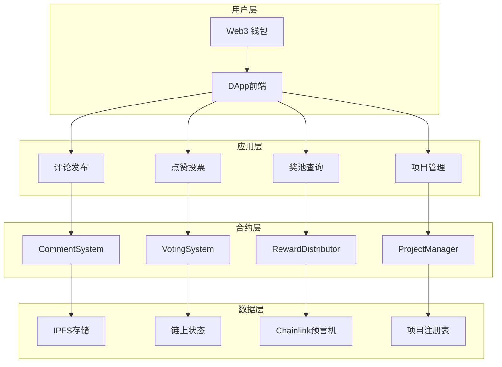

# CoinReal - 币圈大众点评

> 首个让用户通过评论与点赞即可赚取加密货币奖励的去中心化内容社区

## 🎯 项目概述

### 产品定位
CoinReal 是一个创新的去中心化内容社区平台，通过区块链技术实现"评论即收益、点赞即赚币"的商业模式。用户可以在各大加密项目的讨论栏目中发表评论、点赞支持优质内容，并获得相应的代币奖励。赞助方可以赞助他喜欢的项目，赞助的金额会根据动态奖池分配给评论和点赞的用户。

### 核心愿景
打造一个完全去中心化的内容价值评估生态系统，让优质内容创作者和价值发现者都能获得公平的经济回报，推动加密货币社区的健康发展。

## 🔥 核心产品需求

### 1. 用户准入机制 (去中心化身份验证)

#### 1.1 评论者准入条件
- **持币验证**: 历史一个月内持有目标项目代币，且历史资产价值 ≥ $100 USD
- **链上验证**: 通过 Chainlink 预言机实时验证用户钱包资产
- **防刷机制**: 每个钱包地址24小时内仅可对同一项目发表一条评论

#### 1.2 点赞者准入条件  
- **最低资产**: 当前钱包资产 ≥ $1 USD
- **活跃度要求**: 账户需有至少3笔链上交易记录
- **频率限制**: 每个地址每小时最多点赞10次
- **关系验证**: 不可对自己的评论点赞(通过合约地址检查)

### 2. 代币经济模型 (TokenEconomics)

#### 2.1 点评Token机制
```
每个项目创建时自动部署独立的 ERC-20 "点评Token"
- Token名称: [项目名]_Review_Token (例: BTC_Review_Token)
- 初始供应量: 0 (动态铸造)
- 铸造机制: 仅通过用户行为触发
- 销毁机制: 奖池分配后全部销毁,重置游戏
```

#### 2.2 Token获取规则
| 行为 | 获得Token数量 | 触发条件 |
|------|---------------|----------|
| 发表评论 | 20 个基础Token | 通过持币验证 |
| 评论被点赞 | +1 个奖励Token | 每获得一个赞 |
| 点赞他人评论 | 1 个参与Token | 每次有效点赞 |
| 优质评论奖励 | +25% Token | 开奖后进入热度前10 |

#### 2.3 热度计算公式
```
用户热度 = 基础Token + 点赞Token + 时间加权奖励
时间加权系数 = 1 + (周期总时长 - 参与时间) / 周期总时长 * 0.5
```

### 3. 动态奖池分配系统

#### 3.1 奖池资金来源
- **项目方赞助**: 项目方可向自己项目奖池注入资金
- **平台收益**: 交易手续费的10%进入全局奖池
- **社区捐献**: 用户可自愿向喜爱项目捐献
- **合作伙伴**: 交易所、钱包等合作方赞助

#### 3.2 分配机制详解
```
基础奖励池 (60%): 
- 按用户Token占比分配
- 计算公式: 用户奖励 = (用户Token数量 / 总Token数量) * 基础奖池

精英奖励池 (25%):
- 热度排名前10用户均分
- 平均分配,避免马太效应

随机点赞奖励 (15%):
- 从所有点赞用户中随机选择10%
- 最少保证1人获奖
- 使用VRF随机数确保公平性
```

#### 3.3 开奖周期管理
- **灵活周期**: 项目方可设置7-30天开奖周期
- **自动执行**: 到期自动触发分配,无需人工干预（chainlink automation）
- **资金安全**: 奖池资金托管在项目合约中
- **奖励发放**：发放的奖励由赞助的ETH或者对应的Token决定（可能发方eth、USDC、BNB Token），按照分配机制自动发放

### 4. 项目管理系统

#### 4.1 项目创建流程
1. **提交申请**: 填写项目基本信息(名称、简介、官网、白皮书)
2. **代币部署**: 自动创建项目专属的点评Token合约
3. **奖池初始化**: 设置初始奖池和开奖周期
4. **项目上线**: 开放评论和点赞功能

#### 4.2 项目信息标准
```json
{
  "name": "项目名称",
  "symbol": "代币符号", 
  "description": "项目描述",
  "website": "官方网站",
  "whitepaper": "白皮书链接",
  "contractAddress": "项目合约地址",
  "chainId": "所在链ID",
  "category": "项目分类(DeFi/NFT/GameFi/L1/L2等)",
  "launchDate": "创建时间",
  "totalSupply": "代币总供应量",
  "marketCap": "市值(通过预言机获取)"
}
```

### 5. 评论系统详细设计

#### 5.1 评论内容规范
- **字数限制**: 10-500字符
- **格式支持**: 支持Markdown格式和链接
- **多语言**: 支持中英文内容

#### 5.2 评论存储机制
```
链上存储: 评论哈希、时间戳、作者地址、Token奖励记录
IPFS存储: 完整评论内容(通过哈希索引)
本地缓存: 前端展示优化,减少链上查询
```

#### 5.3 评论排序算法
```
热度排序 = (点评Token数) * 时间衰减系数
时间衰减 = 1 / (1 + (当前时间 - 发布时间) / 86400) * 0.3
最终排序 = 热度排序 * (1 + 随机因子 * 0.1)
```

### 6. 基础安全机制

#### 6.1 智能合约安全
- **权限控制**: 合约owner权限管理
- **基础验证**: 输入参数有效性检查
- **资金安全**: 奖池资金安全存储

## 🔧 技术架构升级

### 智能合约架构
```
ProjectFactory.sol - 项目工厂合约(创建和管理项目)
├── ProjectManager.sol - 单个项目管理
├── ReviewToken.sol - 项目专属ERC20代币  
├── CommentSystem.sol - 评论系统
├── VotingSystem.sol - 点赞投票系统
├── RewardDistributor.sol - 奖励分配器
└── PriceOracle.sol - 价格预言机集成
```

### 数据流架构


### 多链部署策略
```
主链 (Ethereum): 核心治理和高价值项目
侧链 (Polygon): 日常交互和小额交易
Layer2 (Arbitrum): 高频操作和批量处理
BSC: 面向币安生态用户
```

## 📱 用户体验设计

### 核心用户流程

#### 新用户引导流程
1. **连接钱包** → 检测资产情况
2. **选择项目** → 展示可参与项目列表
3. **了解规则** → 交互式教程说明
4. **首次评论** → 获得奖励体验成就感
5. **社区互动** → 点赞他人内容获得Token

#### 日常使用流程
```
登录检查资产 → 浏览项目列表 → 选择感兴趣项目 → 
阅读其他评论 → 发表个人观点 → 点赞优质内容 → 
查看收益统计 → 等待奖池开奖 → 领取奖励
```

### 界面设计要求
- **简洁直观**: 降低Web3产品使用门槛
- **数据可视化**: 清晰展示奖池、排名、收益数据
- **移动优先**: 响应式设计支持手机使用  
- **多语言**: 支持中英文切换
- **无障碍**: 支持屏幕阅读器等辅助功能

## 🚀 产品路线图

### Phase 1: MVP核心功能 (3个月)
- [ ] 基础评论和点赞功能
- [ ] 简单奖池分配机制
- [ ] 基础项目管理
- [ ] Web端DApp开发
- [ ] 测试网部署和内测

### Phase 2: 增强功能 (2个月)  
- [ ] 完整治理系统
- [ ] 高级反作弊机制
- [ ] 移动端适配优化
- [ ] 多链支持扩展
- [ ] 主网正式上线

### Phase 3: 生态建设 (持续)
- [ ] 合作伙伴接入API
- [ ] 数据分析面板
- [ ] 社区激励计划
- [ ] 第三方开发者SDK
- [ ] 国际化市场推广

## 🎯 商业模式

### 收入来源
1. **交易手续费**: 奖励分配时收取2%手续费
2. **项目方服务费**: 项目上线收取一次性费用
3. **高级功能**: 数据分析、营销工具等增值服务
4. **合作分成**: 与交易所、钱包的合作收益

### 成本结构
- **开发维护**: 技术团队薪资和服务器费用
- **运营推广**: 社区建设和市场营销

## 📊 关键指标 (KPIs)

### 用户增长指标
- 日活跃用户数 (DAU)
- 新用户注册转化率
- 用户留存率 (7日、30日)
- 平均用户生命周期价值

### 平台活跃度
- 日均评论发布数量
- 日均点赞交互次数  
- 项目讨论参与度
- 用户平均停留时长

### 经济指标
- 平台总锁仓价值 (TVL)
- 奖池资金周转率
- 用户平均收益率
- 项目方续费率

## 🏗️ 技术架构

### 系统架构图

```mermaid
graph TB
    subgraph "前端层 (Web DApp)"
        A[Next.js 15 + TypeScript]
        B[shadcn/ui 组件库]
        C[Tailwind CSS]
        D[钱包连接 (WalletConnect)]
    end
    
    subgraph "区块链层 (Smart Contracts)"
        E[项目管理合约]
        F[评论系统合约]
        G[点赞系统合约]
        H[奖池管理合约]
        I[Token管理合约]
        J[预言机合约]
    end
    
    subgraph "外部服务"
        K[Chainlink Oracle]
        L[IPFS 存储]
        M[多链网络支持]
    end
    
    A --> D
    D --> E
    E --> F
    F --> G
    G --> H
    H --> I
    I --> J
    J --> K
    F --> L
    E --> M
```

### 技术栈

#### 前端 (Web DApp)
- **框架**: Next.js 15 (App Router)
- **语言**: TypeScript
- **样式**: Tailwind CSS + shadcn/ui
- **状态管理**: React 19 内置状态
- **钱包集成**: WalletConnect, MetaMask
- **Web3**: ethers.js / wagmi

#### 后端 (Smart Contracts)
- **开发框架**: Foundry (Forge, Cast, Anvil)
- **编程语言**: Solidity ^0.8.19
- **安全库**: OpenZeppelin
- **预言机**: Chainlink Price Feeds
- **多链支持**: Ethereum, Polygon, BSC, Arbitrum
- **存储**: IPFS (去中心化存储)

#### 基础设施
- **测试网络**: Anvil (本地), Goerli, Mumbai
- **部署工具**: Forge Scripts
- **监控**: Tenderly, Etherscan
- **安全**: 多重签名钱包 (Gnosis Safe)

## 📁 项目结构

```
CoinReal/
├── web/                    # 前端 DApp
│   ├── app/               # Next.js App Router 页面
│   │   ├── page.tsx       # 首页 Landing Page
│   │   ├── projects/      # 项目相关页面
│   │   ├── user/          # 用户个人中心
│   │   └── leaderboard/   # 排行榜页面
│   ├── components/        # React 组件
│   │   ├── ui/           # 基础 UI 组件
│   │   ├── comment-section.tsx
│   │   ├── wallet-connection.tsx
│   │   └── project-layout.tsx
│   └── lib/              # 工具函数和配置
│
├── background/            # 后端智能合约
│   ├── src/              # Solidity 合约源码
│   │   ├── ProjectManager.sol
│   │   ├── CommentSystem.sol
│   │   ├── LikeSystem.sol
│   │   ├── RewardPool.sol
│   │   ├── TokenManager.sol
│   │   ├── PriceOracle.sol
│   │   └── AccessControl.sol
│   ├── test/             # 合约测试
│   ├── script/           # 部署脚本
│   └── lib/              # 外部依赖
│
└── docs/                 # 项目文档
    ├── API.md            # API 接口文档
    ├── DEPLOYMENT.md     # 部署指南
    └── SECURITY.md       # 安全说明
```

## 🚀 快速开始

### 环境要求
- Node.js 23+
- Foundry
- Git
