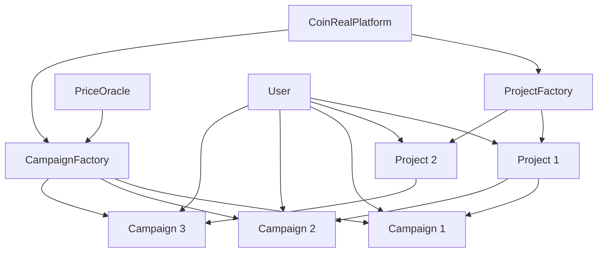

# CoinReal - 币圈大众点评

> 首个通过创新Campaign奖励机制实现"评论即收益、点赞即赚币"的去中心化内容社区

## 🎯 项目概述

CoinReal是一个创新的Web3内容社区平台，通过智能合约和Campaign奖励系统，让用户在参与加密项目讨论的同时获得真实代币奖励。项目采用Project-Campaign分离架构，实现了灵活的奖励机制和可持续的社区激励模式。

### 核心特性

- **🎁 Campaign奖励机制**：任何人可创建Campaign，自定义奖励代币和金额
- **💰 即时奖励**：评论获得5个CRT，点赞获得1个CRT（在所有活跃Campaign中）
- **🔒 Soulbound代币**：CRT代币不可转移，代表真实贡献度
- **⚖️ 公平分配**：60%评论奖励 + 25%点赞奖励 + 15%精英奖励
- **🔄 多Campaign并行**：用户可同时在多个Campaign中获得奖励
- **⏰ 智能延期**：无参与者时自动延长7天，避免资源浪费

## 🏗️ 项目架构

### 技术栈

#### 后端（智能合约）
```
Solidity ^0.8.19
├── 合约框架: OpenZeppelin
├── 开发工具: Foundry
├── 测试网络: Anvil (本地) / Sepolia (测试)
└── 部署工具: Forge Script
```

#### 前端（Web应用）
```
Next.js 15.2.4 + React 19.0.0
├── Web3集成: Wagmi 2.15.6 + Viem 2.x
├── 状态管理: TanStack Query 5.81.2
├── UI框架: Tailwind CSS 4.0 + shadcn/ui
├── 类型支持: TypeScript 5
└── 包管理: pnpm
```

### Campaign系统架构



## 🎮 Campaign工作流程

### 1. 项目创建
```
用户 → CoinRealPlatform.createProject() → ProjectFactory → Project合约部署
```

### 2. Campaign创建
```
赞助者 → 代币授权 → CampaignFactory.createCampaign() → Campaign合约部署 → 添加到Project
```

### 3. 用户参与
```
用户评论/点赞 → Project合约 → 通知所有活跃Campaign → 铸造CRT奖励
```

### 4. 奖励分配
```
Campaign结束 → 平台分配奖励 → 用户领取真实代币
```

## 📁 项目结构

```
CoinReal/
├── background/                 # 智能合约后端
│   ├── src/                   # 合约源码
│   │   ├── CoinRealPlatform.sol    # 平台主合约
│   │   ├── Project.sol             # 项目合约
│   │   ├── Campaign.sol            # Campaign合约 (ERC20)
│   │   ├── ProjectFactory.sol      # 项目工厂
│   │   ├── CampaignFactory.sol     # Campaign工厂
│   │   └── MockPriceOracle.sol     # 价格预言机
│   ├── script/                # 部署脚本
│   ├── test/                  # 合约测试
│   ├── abi-json/              # ABI文件
│   └── deployments.json       # 部署信息
├── frontend/                  # Web前端应用
│   ├── app/                   # Next.js页面
│   ├── components/            # React组件
│   ├── hooks/                 # 自定义Hooks
│   ├── lib/                   # 工具库
│   ├── types/                 # 类型定义
│   └── public/                # 静态资源
└── README.md                  # 项目文档
```

## 🚀 快速开始

### 环境要求
- Node.js 18+
- pnpm 8+
- Foundry (for contracts)
- Git

### 1. 克隆项目
```bash
git clone <repository-url>
cd CoinReal
```

### 2. 安装依赖
```bash
# 安装前端依赖
cd frontend
pnpm install

# 安装合约依赖
cd ../background
forge install
```

### 3. 启动本地区块链
```bash
cd background
anvil
```

### 4. 部署合约
```bash
# 在新终端中部署合约
forge script script/Deploy.s.sol \
  --private-key 0xac0974bec39a17e36ba4a6b4d238ff944bacb478cbed5efcae784d7bf4f2ff80 \
  --rpc-url http://localhost:8545 \
  --broadcast

# 复制ABI和部署信息到前端
cp abi-json/*.json ../frontend/public/abi-json/
cp deployments.json ../frontend/public/deployments.json
```

### 5. 启动前端
```bash
cd ../frontend
pnpm dev
```

访问 http://localhost:3000 开始使用！

## 💰 奖励机制详解

### CRT代币系统
- **命名规则**：`项目名-Campaign编号` (如: Bitcoin-Campaign1)
- **代币符号**：CRT (固定)
- **精度**：18位小数，前端显示为整数
- **特性**：Soulbound（不可转移），代表真实贡献度

### 奖励规则
| 行为 | CRT奖励 | 说明 |
|------|---------|------|
| 发表评论 | 5 CRT | 在所有活跃Campaign中获得 |
| 点赞评论 | 1 CRT | 点赞者获得 |
| 被点赞 | 1 CRT | 被点赞者获得 |

### 分配机制
Campaign结束时按以下比例分配奖池：
- **60%** - 按CRT占比分配给所有参与者
- **25%** - 按点赞CRT占比分配给点赞活跃用户  
- **15%** - 平分给获得CRT最多的评论者（精英奖励）

### 自动延期
如果Campaign结束时没有参与者，自动延长7天，避免奖励资源浪费。

## 🔧 智能合约接口

### 核心合约

#### CoinRealPlatform（平台主合约）
```solidity
// 创建项目
function createProject(
    string calldata name,
    string calldata symbol,
    string calldata description,
    string calldata category,
    uint16 drawPeriod
) external returns (address projectAddress);

// 获取项目列表
function getProjects(uint256 offset, uint256 limit) 
    external view returns (ProjectInfo[] memory, uint256 total);

// 获取平台统计
function getPlatformStats() external view returns (
    uint256 totalProjects,
    uint256 totalUsers,
    uint256 totalComments,
    uint256 totalCampaigns
);
```

#### Project（项目合约）
```solidity
// 发表评论
function postComment(string calldata content) 
    external returns (uint256 commentId);

// 点赞评论
function likeComment(uint256 commentId) external;

// 获取用户CRT详情
function getUserCampaignCRTDetails(address user) external view returns (
    address[] memory campaignAddresses,
    uint256[] memory commentCRTs,
    uint256[] memory likeCRTs,
    uint256[] memory totalCRTs,
    uint256[] memory pendingRewards
);
```

#### Campaign（Campaign合约，继承ERC20）
```solidity
// ERC20基础功能（Soulbound）
function balanceOf(address account) external view returns (uint256);
function totalSupply() external view returns (uint256);

// 获取用户CRT详情
function getUserCRTBreakdown(address user) external view returns (
    uint256 commentTokens,
    uint256 likeTokens,
    uint256 totalTokens,
    uint256 pendingReward
);

// 领取奖励
function claimRewards() external;
```

#### CampaignFactory（Campaign工厂）
```solidity
// 创建Campaign
function createCampaign(
    address project,
    string calldata sponsorName,
    uint256 duration,
    address rewardToken,
    uint256 rewardAmount
) external returns (address campaignAddress);
```

## 🌐 前端API接口

### 项目相关
```typescript
// 获取项目列表
const projects = await api.getProjects(offset?, limit?)

// 获取项目详情
const project = await api.getProject(projectAddress)

// 创建项目
const projectAddress = await api.createProject(projectData)
```

### Campaign相关
```typescript
// 获取项目Campaign列表
const campaigns = await api.getProjectCampaigns(projectAddress)

// 创建Campaign
const campaignAddress = await api.createCampaign({
  projectAddress,
  sponsorName,
  duration,
  rewardToken,
  rewardAmount
})

// 获取用户CRT详情
const userCRT = await api.getUserCampaignCRTDetails(projectAddress, userAddress)

// 领取奖励
await api.claimCampaignReward(campaignAddress)
```

### 评论相关
```typescript
// 获取评论列表
const comments = await api.getProjectComments(projectAddress)

// 发表评论（获得5个CRT）
const comment = await api.postComment(projectAddress, content)

// 点赞评论（双方各获得1个CRT）
await api.likeComment(projectAddress, commentId)
```

## 📊 数据转换

### CRT精度转换
```typescript
// 18位小数 → 整数显示
const displayCRT = parseInt(formatUnits(crtAmount, 18))

// 整数 → 18位小数
const weiCRT = parseUnits(amount.toString(), 18)
```

### 时间处理
```typescript
// 计算剩余时间
const remainingTime = Math.max(0, endTime - Math.floor(Date.now() / 1000))

// 友好显示
const formatTime = (seconds) => {
  const days = Math.floor(seconds / 86400)
  const hours = Math.floor((seconds % 86400) / 3600)
  return days > 0 ? `${days}天${hours}小时` : `${hours}小时`
}
```

## 🛡️ 安全特性

### 合约安全
- **权限控制**：基于角色的访问控制
- **重入保护**：使用OpenZeppelin的ReentrancyGuard
- **整数溢出**：Solidity 0.8+内置保护
- **最小代理模式**：节省95%部署成本，降低攻击面

### 前端安全
- **输入验证**：所有用户输入严格验证
- **XSS防护**：内容渲染安全处理
- **网络验证**：确保连接到正确的区块链网络

## 🔍 技术亮点

### 1. Project-Campaign分离架构
- **职责分离**：项目专注内容管理，Campaign专注奖励分配
- **灵活扩展**：任何人可为项目创建Campaign
- **独立治理**：每个Campaign有独立的奖励规则

### 2. Soulbound CRT代币
- **真实贡献**：代币不可转移，代表真实参与度
- **防刷机制**：避免机器人刷取奖励
- **公平竞争**：基于贡献度的公平分配

### 3. 最小代理模式
- **成本优化**：节省95%+的部署Gas费用
- **标准化**：所有Campaign使用相同的实现逻辑
- **安全性**：降低合约复杂度和攻击面

### 4. 自动延期机制
- **资源优化**：避免无效Campaign浪费奖励
- **用户友好**：给予更多参与时间
- **平台管理**：自动化的Campaign生命周期管理

## 📈 使用场景

### 1. 项目方推广
- 创建Campaign推广新项目
- 通过代币奖励吸引用户关注
- 获得真实用户反馈和讨论

### 2. 社区建设
- 奖励活跃的社区成员
- 促进高质量内容创作
- 建立可持续的激励机制

### 3. 投资者研究
- 参与项目讨论获得奖励
- 通过CRT余额展示专业度
- 获得第一手项目信息

### 4. KOL影响力
- 通过高质量评论获得精英奖励
- 建立专业声誉和影响力
- 获得额外的代币收益

## 🚀 未来规划

### 短期目标（3个月）
- [ ] 部署到Sepolia测试网
- [ ] 完善精英评论算法
- [ ] 增加更多代币支持
- [ ] 移动端适配

### 中期目标（6个月）
- [ ] 主网部署
- [ ] Layer 2集成（Polygon/Arbitrum）
- [ ] NFT奖励系统
- [ ] 社交功能增强

### 长期目标（1年）
- [ ] 多链扩展
- [ ] DAO治理系统
- [ ] AI内容推荐
- [ ] 企业级功能

## 🤝 贡献指南

### 开发流程
1. Fork项目到个人仓库
2. 创建功能分支：`git checkout -b feature/amazing-feature`
3. 提交更改：`git commit -m 'Add amazing feature'`
4. 推送分支：`git push origin feature/amazing-feature`
5. 创建Pull Request

### 代码规范
- **Solidity**：遵循OpenZeppelin风格指南
- **TypeScript**：使用严格模式，完整类型定义
- **React**：函数式组件，Hooks优先
- **测试**：保持90%+代码覆盖率

### 问题反馈
- 使用GitHub Issues报告Bug
- 详细描述问题复现步骤
- 提供相关的日志和截图

## 📄 许可证

本项目采用 MIT 许可证 - 查看 [LICENSE](LICENSE) 文件了解详情。

## 📞 联系我们

- **GitHub**: [项目仓库](https://github.com/your-org/coinreal)
- **Discord**: [社区频道](https://discord.gg/coinreal)
- **Twitter**: [@CoinReal](https://twitter.com/coinreal)
- **Email**: contact@coinreal.io

---

## 📊 项目统计


**构建日期**: 2024年1月  
**版本**: v1.0.0  
**维护者**: CoinReal 开发团队

---

*CoinReal - 让每一个观点都有价值，让每一次参与都有收益* 🚀
